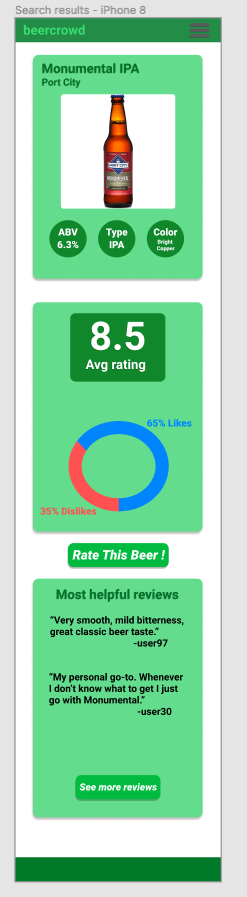
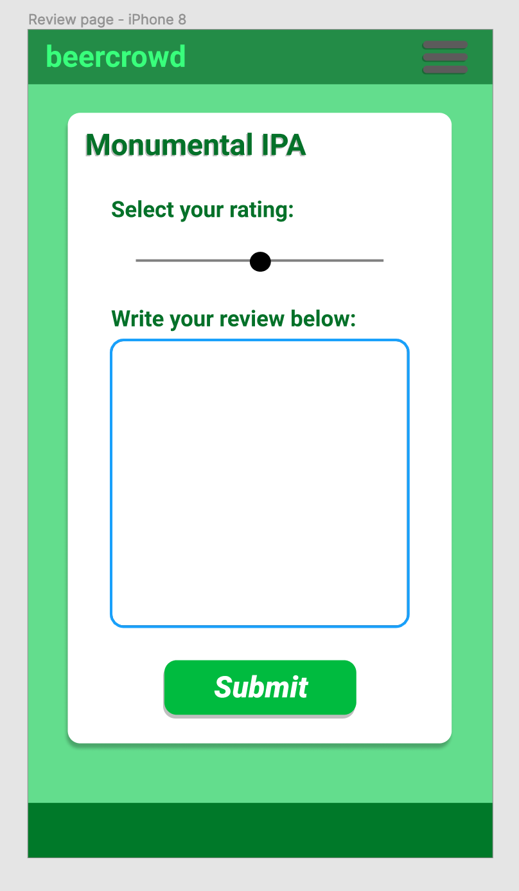

# beercrowd.com (Crowd sourced beer review website)

## User Journeys 

* I love beer and I often enjoy trying out new beers that I haven't had before. The problem is that there's often hundreds of different beers to choose from and so it can be difficult to decide just by myself. I found beercrowd.com and was able to see other beer lover's reviews and ratings on beers. It makes making a decision to try new beer much easier. 

* Just about everytime I end up in the beer aisle at the grocery store, I take my time and figure out what I want. Sometimes I'll be in a mood for something I haven't tried before but I always do a quick search on google just to see. Unfortunately, it can be time consuming to have to sort through all sorts of random websites and articles just to get an idea of what a particular beer tastes like. I found beercrowd.com while searching for a beer and it makes seeing what others think about a particular beer much easier. I can just pull up beercrowd.com when I'm in the beer aisle and quickly look up a beer that I'm interested in. Based on what I see on beercrowd.com, I can more easily make a decision whether to try a particular beer out. 

## Mockups
### Cover Page

### Search Results Page

### Review Page 

